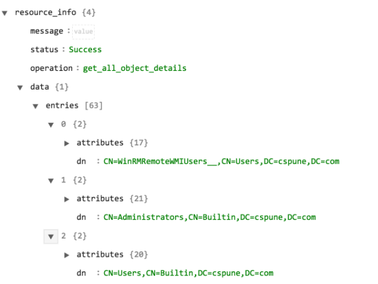
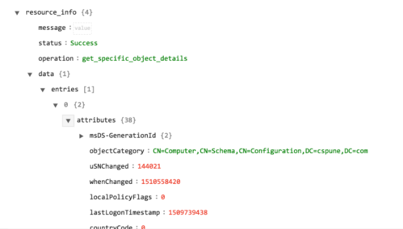
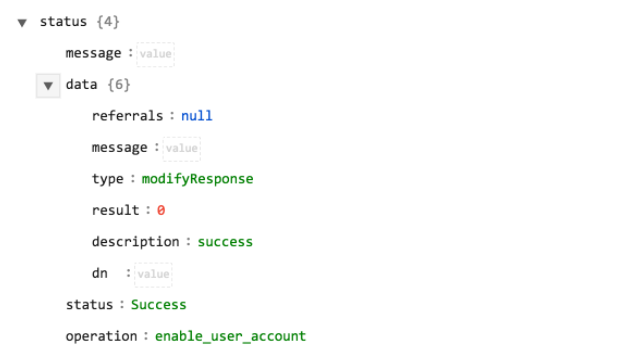
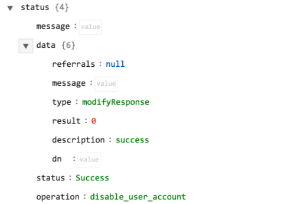
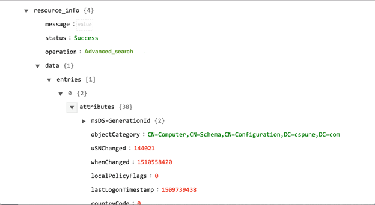

## About the connector
Active Directory (AD) is a directory service that Microsoft developed for Windows domain networks. You can directly query AD to retrieve information about users, groups, and computers, in an organization, by using the Lightweight Directory Access Protocol (LDAP) to directly query the AD. 

This document provides information about the Active Directory connector, which facilitates automated interactions with a Active Directory server using CyOPs™ playbooks. Add the Active Directory connector as a step in CyOPs™ playbooks and perform automated operations, such as automatically retrieving all the information for users, groups and computers in the AD and retrieving a list of search attributes that you can use to search AD.

### Version information
Connector Version: 2.0.1

Compatibility with CyOPs™ Versions: 4.9.0.0-708 and later

Compatibility with Active Directory Versions: Windows Server 2012 R2 and later

### Release Notes for version 2.0.1

Following enhancements have been made to the Active Directory Connector in version 2.0.1:

- Enhanced the UI by adding tooltips and placeholder context.

- Added the following new operations:

    - Reset Password
    - Advanced Search
- Enhanced the Get Specific Object Details operation by adding onchange parameter.

!!! Warning "Important"  
		If you already have installed the version 1.0.0 or 1.1.0 version of the AD connector and if you run an update for the same to versions 2.0.0 or 2.0.1 then version 2.0.0 or 2.0.1 of the AD connector version is deployed on the system but older versions either 1.0.0 or 1.1.0 are also retained. This is because the AD connector version 2.0.0 and 2.0.1 has different operations than the AD connector 1.0.0 or 1.1.0.

## Installing the connector

All connectors provided by  CyOPs™ are delivered using a CyOPs™ repository. Therefore, you must set up your CyOPs™ repository and use the `yum` command to install connectors:

`yum install cyops-connector-activedirectory`

**Note**: The Active Directory connector has an additional dependency on the `ldap3` library. If you are using python 3.4, you must use version 3 of  `ldap`. The Active Directory connector tries to install the `ldap3` library during the installation process. However, if the installation process fails then you might require to perform some manual steps.

To update a  CyOPs™-provided connector use the following command:

`yum update cyops-connector-activedirectory`

To remove a  CyOPs™-provided connector use the following command:

`yum remove cyops-connector-activedirectory`

The process to write your own custom connector is defined in the `Building a custom connector` topic.

## Prerequisites to configuring the connector

- You must have the IP address or Hostname of the Active Directory server to which you will connect and perform the automated operations and credentials to access that server. 
- You must open port 389, for TCP or UDP connections, or 636 for TCP connections over SSL, on the firewall to allow communication between CyOPs™ and the Active Directory server.

## Configuring the connector

!!! Note  
		This procedure assumes that you are using CyOPs™ version 4.10.3. If you are using a different version of CyOPs™, such as CyOPs™ 4.9, then it is possible that the CyOPs™ UI navigation is different. Refer to the CyOPs™ documentation of that particular version for details about CyOPs™ navigation.

1. In CyOPs™, on the left pane, click **Connectors**.  
   On the `Connectors` page, you will see  the `Active Directory` connector.
2. To configure the connector parameters, click the Active Directory connector row to open the **Configurations** tab. Enter the required configuration details in the **Configurations** tab.   
   You must provide a name for you configuration and you can optionally check the **Mark As Default Configuration** checkbox to make Active Directory connector point to this configuration by default.   
   You must provide configuration parameters such as the IP address or Hostname of the Active Directory server and credentials to access the Active Directory server.   
   For a complete list of configuration parameters, see the [Configuration parameters](#Configuration-parameters) section.  
   **Note**: You can add multiple configurations if you have more than one Active Directory server instances in your environment. You must, therefore, specify a unique `Name` to identify each configuration in your environment. 
   You can activate or deactivate the connector by clicking the **Activate Connector** or **Deactivate Connector** link.
3. To save your configuration, click **Save**.  
   To view the list of actions that can be performed by the connector, click the **Actions** tab.  
   To view the playbook file that is bundled with the connector, click the **Playbooks** tab. Refer to the [Included Playbooks](#Included-playbooks) section for details on the bundled playbooks. You can see the bundled playbooks by clicking on the **Sample - ActiveDirectory - 2.0.1** link after importing the Active Directory connector.   
   You can also see the bundled playbooks in the **Automation** > **Playbooks** section in CyOPs™ after importing the Active Directory connector. 
4. (Optional) You can also perform the health check and check the connectivity to the Active Directoryserver and validity of the credentials provided anytime, by clicking the **Refresh** icon that is present in the `Health Check` bar.   
   If all the details are correct and the connectivity to the Active Directory server is established then on the `Connectors` page, **Available** is displayed in the health check dialog.  
   If any or all the details are incorrect or if the connectivity to the Active Directory server cannot be established then on the `Connectors` page, **Disconnected** is displayed in the health check dialog.

### Configuration parameters

In CyOPs™, on the Connectors page, select the **Active Directory** connector and click **Configure** to configure the following parameters:

| Parameter | Description                                                  |
| --------- | ------------------------------------------------------------ |
| Hostname  | IP address or Hostname of the Active Directory (AD) server.  |
| Port      | Port number used for connecting to the AD server.            |
| Username  | Valid AD service account with a minimum of read access.      |
| Password  | Password for your AD user.                                   |
| Base DN   | The base, or node from where the LDAP search should start.  All connector operations are carried out using the Base DN as a root to the AD organization tree.   You can restrict the AD lookup by providing appropriate filters in this parameter. Some examples of the same are as follows:   `DC=cspune,DC=com`   `OU=workstation,DC=cspune,DC=com`   `OU=Develop,OU=workstation,DC=cspune,DC=com` |
| Bind DN   | The fully distinguished name that is used to bind to the LDAP server. |
| Use TLS   | Specifies whether SSL and TLS will be required to establish the connection between the Active Directory connector and the AD server.  By default, this option is set as `false`, and therefore, SSL is used by default. |

## Actions supported by the connector

The following automated operations can be included in playbooks and you can also use the annotations to access operations from CyOPs™ release 4.10.0 onwards:

| Function                    | Description                                                  | Annotation and Category           |
| --------------------------- | ------------------------------------------------------------ | --------------------------------- |
| Global Search               | Searches and retrieves records from AD using global search, based on the specified search object, such as user, computer, group, search attribute, or a search attribute value, such as SamAccount Name, Distinguished Name, Common Name, Display Name, or Email. When you search a record based on a search attribute value, the record from AD is retrieved based on the specified attribute value. | search_query   Investigation |
| Get All Objects Details     | Searches and retrieves all records from AD based on a specified search object, such as user, computer, or group. | search_query   Investigation |
| Get Specific Object Details | Searches and retrieves records from AD based on a specified search object, such as user, computer, or group. However, this search is limited to the records found for the object name you have specified.   For example, if you want to retrieve the records from AD for a specific user, you need to specify the name of the user. | search_query   Investigation |
| Enable User Account         | Enables the account of a specific AD user based on the SamAccount Name or the Email of the user. | enable_user   Containment    |
| Disable User Account        | Disables the account of a specific AD user based on the SamAccount Name or the Email of the user. | disable_user   Containment   |
| Reset Password              | Resets the password for a specific AD user based on the SamAccount Name or the Email, or the Distinguished Name of the user. | reset_password   Containment |
| Advanced Search             | Executes an advanced LDAP query which searches and retrieves AD records based on your custom query. | search_query   Investigation |

**Note**: If Active Directory connector does not find a record in AD, then the playbook displays the `Record Not found in Active Directory` message. This message is displayed if the search entity is not present in the AD Base DN configured in the Active Directory connector. You can use this message to formulate the condition in the playbook for the next playbook step.

### operation: Global Search

#### Input parameters

| Parameter        | Description                              |
| ---------------- | ---------------------------------------- |
| Object Type      | The object type, such as User, Computer, Group, or Person, based on which you want to search and retrieve records from AD. |
| Attribute Type   | The attribute type, such as SamAccount Name, DistinguishedName, Common Name, Display Name, or Email, based on which you want to search and retrieve records from AD. |
| Attribute Values | The attribute value based on which you want to search and retrieve records from AD. |

#### Output

The JSON output contains the records based on the specified search object retrieved from AD. Each record contains its attributes such as user, group, computer, SamAccount Name, Distinguished Name, Display Name, and Given Name using which you can perform a global search in AD.

Following image displays a sample output of object of type `Person` with the `SamAccount Name` specified:

### operation: Get All Objects Details

#### Input parameters

| Parameter   | Description                              |
| ----------- | ---------------------------------------- |
| Object Type | The object type, such as User, Computer, Group, or Person, based on which you want to search and retrieve all records from AD. |

#### Output

The JSON output contains all existing records based on the specified search object retrieved from AD.

Following image displays a sample output of object of type `Group`:

### operation: Get Specific Object Details

#### Input parameters

| Parameter       | Description                              |
| --------------- | ---------------------------------------- |
| Object Type     | The object type, such as User, Computer, Group, or Person, based on which you want to search and retrieve records from AD.   If you select the Object Type as Person then you must also add the inputs for the CN and SN parameters. |
| SamAccount Name | The SamAccountName of the object based on which you want to search and retrieve records from AD. |
| CN              | Common name of the Person you want to search and retrieve records from AD. |
| SN              | Surname of the Person you want to search and retrieve records from AD. |

#### Output

The JSON output contains the records based on the name specified for the search object retrieved from AD.

Following image displays a sample output of object of type `Computer` with the ` Name` specified:

### operation: Enable User Account

#### Input parameters

| Parameter       | Description                              |
| --------------- | ---------------------------------------- |
| Attribute Type  | The attribute, either the SamAccount Name or the Email of the user, based on which you want to enable a user account in AD. |
| Attribute Value | The value of the SamAccount Name or the Email of the user, based on which you want to enable a user account in AD. |

#### Output

The JSON output contains a message stating whether or not the specified user account is enabled successfully

Following image displays a sample output:

### operation: Disable User Account

#### Input parameters

| Parameter       | Description                              |
| --------------- | ---------------------------------------- |
| Attribute Type  | The attribute, either the SamAccount Name or the Email of the user, based on which you want to disable a user account in AD. |
| Attribute Value | The value of the SamAccount Name or the Email of the user, based on which you want to disable a user account in AD. |

#### Output

The JSON output contains a message stating whether or not the specified user account is disabled successfully.

Following image displays a sample output:

### operation: Reset Password

#### Input parameters

| Parameter       | Description                                                  |
| --------------- | ------------------------------------------------------------ |
| Attribute Type  | The attribute, either the SamAccount Name, Distinguished Name, or the Email of the user, whose password you want to reset in AD. |
| Attribute Value | The value of the SamAccount Name, the Distinguished Name, or the Email of the user, whose password you want to reset in AD. |
| New Password    | The password that you want to set for the specific user.   The new password must meet the password policy requirements. For password policy requirements and the minimum password length, password complexity, and password history requirements, see [https://www.grouppolicy.biz/2011/08/tutorial-how-to-setup-default-and-fine-grain-password-policy/](https://www.grouppolicy.biz/2011/08/tutorial-how-to-setup-default-and-fine-grain-password-policy/). |

#### Output

The JSON output contains a message stating whether or not the password is reset for the specified user account.

Following image displays a sample output:

### operation: Advanced Search

#### Input parameters

| Parameter  | Description                                                  |
| ---------- | ------------------------------------------------------------ |
| LDAP Query | The custom LDAP query based on which you want to retrieve records from AD. |

#### Output

The JSON output contains all the existing records based on the specified LDAP query retrieved from AD. 

Following image displays a sample output:

## Included playbooks

The `Sample - ActiveDirectory - 2.0.1`  playbook collection comes bundled with the Active Directory connector. This playbook contains steps using which you can perform all supported actions. You can see the bundled playbooks in the **Automation** > **Playbooks** section in CyOPs™ after importing the Active Directory connector.

- Advanced Search
- Disable User Account
- Enable User Account
- Get All Object Details
     - Get all Computers Details  
     - Get all Groups Details
     - Get all Users Details
- Get Specific Object Details
    - Get Specific Computer details  
    - Get Specific Group details
    - Get Specific User details 
- Reset Password
- Global Search
    - Search by Common Name
    - Search by Distinguished Name 
    - Search by Email 
    - Search by SamAccount Name

**Note**: If you are planning to use any of the sample playbooks in your environment, ensure that you clone those playbooks and move them to a different collection, since the sample playbook collection gets deleted during connector upgrade and delete.